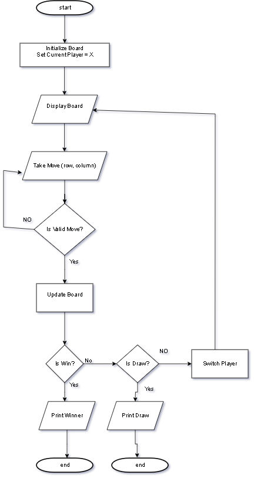

# XO Game (Tic-Tac-Toe) using C++

## 📌 Project Description
This project is a simple XO (Tic-Tac-Toe) game implemented using C++.  
The game is played between two players in the terminal.

- Player 1 uses **X**
- Player 2 uses **O**

Players take turns entering their moves, and the game checks for a win or a draw after each move.

---

## 🎮 Game Features
- 3×3 game board
- Two-player turn-based gameplay
- Input validation (no invalid or repeated moves)
- Win detection (rows, columns, diagonals)
- Draw detection
- Clear board display after each move

---

## 🧠 Program Structure
The program is organized using multiple functions to keep the code clean and readable:

- `displayBoard()` – Displays the game board
- `takeMove()` – Takes player input
- `isValidMove()` – Validates user input
- `updateBoard()` – Updates the board
- `checkWin()` – Checks win conditions
- `checkDraw()` – Checks draw condition
- `PlayGame()` – Controls the main game loop

---
## 🔁 Flowchart
The following flowchart shows the logic of the XO (Tic-Tac-Toe) game:




## 📦 Arrays and Pointers
- A 3×3 two-dimensional array is used to represent the game board.
- The array is passed to functions using pointers (internally in C++), allowing functions to modify the same board without copying it.

---

## ▶️ How to Run
1. Compile the program using any C++ compiler:
   ```bash
   g++ main.cpp -o xo
